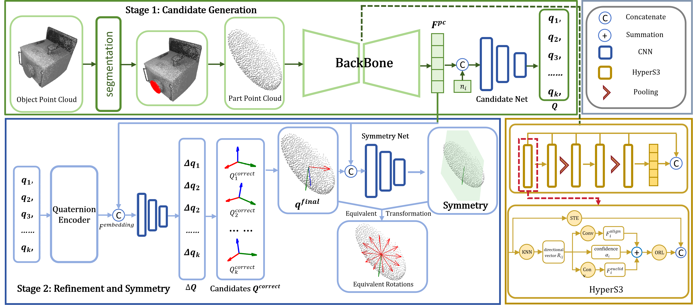

## Generalizable and Actionable Parts Pose Estimation with Symmetry Annotation-Free Learning Strategy [ICML 2026]

Official implementation of the SAFAG(ICML2026).

## Overview



**Overview of our framework.** First, we construct a backbone with our designed $S^3$ hyperspherical (HyperS3) layer to extract point cloud feature. Then, we generate quaternion candidates and refine each on the hyperspherical manifold of quaternion $S^3$. To better cope with the multi-hypothesis caused by symmetry, we additionally design a self-adaptive network to estimate the symmetry axes or planes, based on which we generate the corresponding equivalent solutions later. Finally, we aggregate all refined candidates and apply an additional refinement step, yielding $q_{final}$.

## Requirements

- absl 0.0
- detectron2 0.6
- ipdb 0.13.13
- lib 4.0.0
- matplotlib 3.7.5
- mmcv 2.2.0
- mmengine 0.10.7
- numpy 1.24.3
- opencv_python 4.13.0.92
- six 1.17.0
- termcolor 3.3.0
- torch 2.0.0+cu118
- torchvision 0.15.0+cu118
- tqdm 4.67.3

## Installation

#### Install PyTorch

```
pip install torch==2.0.0+cu118 torchvision==0.15.0+cu118 --index-url https://download.pytorch.org/whl/cu118
```

#### Install OpenMMLab dependencies

```
pip install mmengine==0.10.7
pip install mmcv==2.2.0
```

#### Install Detectron2

```
pip install detectron2==0.6
```

#### Install basic dependencies

```
pip install absl-py==0.0
pip install ipdb==0.13.13
pip install matplotlib==3.7.5
pip install numpy==1.24.3
pip install opencv-python==4.13.0.92
pip install six==1.17.0
pip install termcolor==3.3.0
pip install tqdm==4.67.3
```

## Dataset

This project uses a processed version of the GAPartNet dataset. The processed data is derived from the official GAPartNet release and is provided only for research and non-commercial use, following the license of the original dataset.

Please also refer to the official GAPartNet project page for the original dataset, license terms, and detailed usage instructions:

- Official GAPartNet website: [https://pku-epic.github.io/GAPartNet/](https://pku-epic.github.io/GAPartNet/)
- Processed dataset used in this project: [Data Download]()

After downloading and extracting,  the processed dataset should be organized as follows:

```
your_path/
├── sampled_gapart/
│   ├── seen/
│   │   ├── 1/
│   │   ├── ...
│   │   └── 9/
│   └── unseen/
│       ├── 1/
│   │   ├── ...
│       └── 9/
├── sampled_npcs/
│   ├── seen/
│   │   ├── 1/
│   │   ├── ...
│   │   └── 9/
│   └── unseen/
│       ├── 1/
│   │   ├── ...
│       └── 9/
└── pose/
    ├── seen/
    │   ├── train/
    │   └── test/
    └── unseen/
        ├── 1/
        ├── 2/
        ├── 3/
        ├── 4/
        ├── 5/
        ├── 6/
        ├── 7/
        ├── 8/
        └── 9/
```

The numeric folders correspond to different GAPart classes:

```
1: Line_Fixed_Handle
2: Round_Fixed_Handle
3: Slider_Button
4: Hinge_Door
5: Slider_Drawer
6: Slider_Lid
7: Hinge_Lid
8: Hinge_Knob
9: Hinge_Handle
```

## Model


## Quick Satrt

#### Traning


#### Evaluation


## Citation

coming soon.

## Acknowledgement

Our implementation is partially based on and inspired by [HS-Pose](https://github.com/Lynne-Zheng-Linfang/HS-Pose) and [GPV-Pose](https://github.com/lolrudy/GPV_Pose). We sincerely thank the authors for releasing their code and valuable implementations. Both HS-Pose and GPV-Pose are released under the MIT License. Please refer to their original repositories for detailed license terms.

The processed dataset used in this repository is derived from the official [GAPartNet ](https://pku-epic.github.io/GAPartNet/) dataset. Users are responsible for complying with the licenses and usage terms of the original datasets, base models, and released checkpoints.
